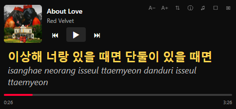
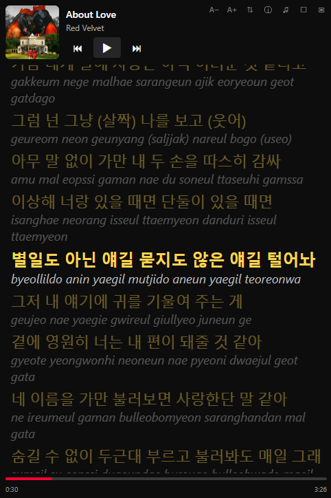
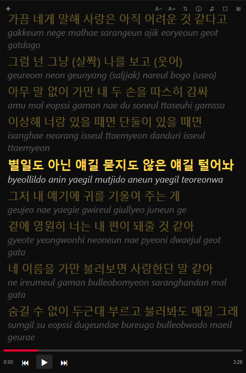
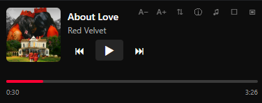

# Mini Player

A compact, always-on-top mini player window in the spirit of MiniLyrics: small enough to park in a corner of your desktop, with full playback controls and scrolling synced lyrics (including romanization and translation when enabled).

The mini player and the main window are **exclusive** — opening the mini player minimizes the main window, and restoring the main window closes the mini player — so your music is always controlled from exactly one place. You can switch between them at any time from either side.

## Getting started

1. In the menu bar, open **Plugins → Mini Player** and tick **Enabled**.
2. Click the picture-in-picture icon (▣) in the top bar of the main window, or enable **Plugins → Mini Player → Show mini player**.
3. The mini player opens and the main window minimizes automatically.

Lyrics come from the **Synced Lyrics** plugin — enable it too (**Plugins → Synced Lyrics → Enabled**) if you want lyrics in the mini player. Romanization and translation follow that plugin's settings.

## Features

### Synced lyrics, romanization and translation

When a song has synced lyrics, they scroll automatically and the current line stays centered. Click any line to jump to that point in the song. Romanized lyrics (e.g. romanized Hangul) and translations are shown under each line when enabled in the Synced Lyrics plugin settings.

### Lyrics emphasis

The current line can be rendered larger than the rest. Cycle presets with the `⇕` toolbar button (None → Subtle → Normal → Strong) or pick one from **Plugins → Mini Player → Lyrics emphasis**. Changing emphasis never resizes the window unless it is at its minimum height.

### Lyrics size and color

Use the `A−` / `A+` toolbar buttons to scale lyrics between 70% and 180%. The text color can be changed under **Lyrics color**: White, Gold, Yellow, Cyan, Light Blue, Green, Red or Pink.

### Hide album art and song info

The `ⓘ` toolbar button hides the album art, title and artist. The playback controls then move to the bottom of the window, between the elapsed and remaining time, so the lyrics get the whole window.

### Transparent background ("flying lyrics")

The `☐` toolbar button makes the window background invisible, so the lyrics appear to float on your desktop. Everything except the lyrics fades out while the mouse is away and fades back in when you hover over the window.

### Lyrics area toggle

The `♫` toolbar button collapses the lyrics area for a minimal controller — the window shrinks to fit and the minimum height adapts automatically. Toggle it back at any time.

### Always on top

Enabled by default: the mini player stays above all other windows. Turn it off with **Plugins → Mini Player → Always on top** if you prefer a normal window.

### Window management

The frameless window is moved by its `✥` drag handle (top left) and can be resized from any edge. The minimum height always adapts so the toolbar, song info, controls and current lyric line remain visible. All settings — size, colors, emphasis, toggles — persist across restarts.

## Toolbar reference

| Icon | Action |
| ---- | ------ |
| `✥` | Drag to move the window |
| `A−` / `A+` | Smaller / bigger lyrics (70% – 180%) |
| `⇕` | Cycle lyrics emphasis (None / Subtle / Normal / Strong) |
| `ⓘ` | Show / hide album art and song info |
| `♫` | Show / hide the lyrics area |
| `☐` | Transparent background |
| `▣` | Switch to the main player |

The toolbar sits in the top right corner. Its icons are slightly dimmed and brighten on hover; in transparent mode it is fully hidden until you hover over the window. The bottom row has previous / play-pause / next buttons and a seek bar.

## Menu reference

All settings live under **Plugins → Mini Player** in the main window:

| Setting | Description |
| ------- | ----------- |
| Show mini player | Open or close the mini player window |
| Always on top | Keep the mini player above all other windows |
| Hide album art and song info | Hide art, title and artist (playback buttons stay) |
| Show lyrics | Show or hide the lyrics area |
| Transparent background | Lyrics float on the desktop; UI reveals on hover |
| Lyrics emphasis | How much larger the current line is: None / Subtle / Normal / Strong |
| Lyrics color | Text color of the lyrics: White, Gold, Yellow, Cyan, Light Blue, Green, Red, Pink |

## Tips & troubleshooting

- **No lyrics in the mini player** — make sure the Synced Lyrics plugin is enabled and the current song actually has synced (time-coded) lyrics. The window shows *Loading lyrics…* while fetching and *No lyrics found* otherwise.
- **Romanization or translation missing** — these follow the Synced Lyrics plugin settings; enable them there.
- **Transparent background** requires a compositor on Linux (enabled by default on most desktops); on Windows and macOS it works out of the box.
- **The window won't shrink further** — you have reached the adaptive minimum height, which always keeps the current lyric line and controls visible. Hide the lyrics area (`♫`) or the song info (`ⓘ`) to go smaller.
